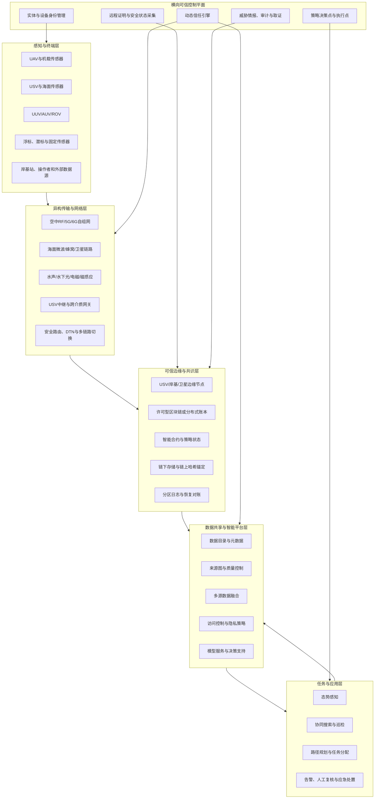
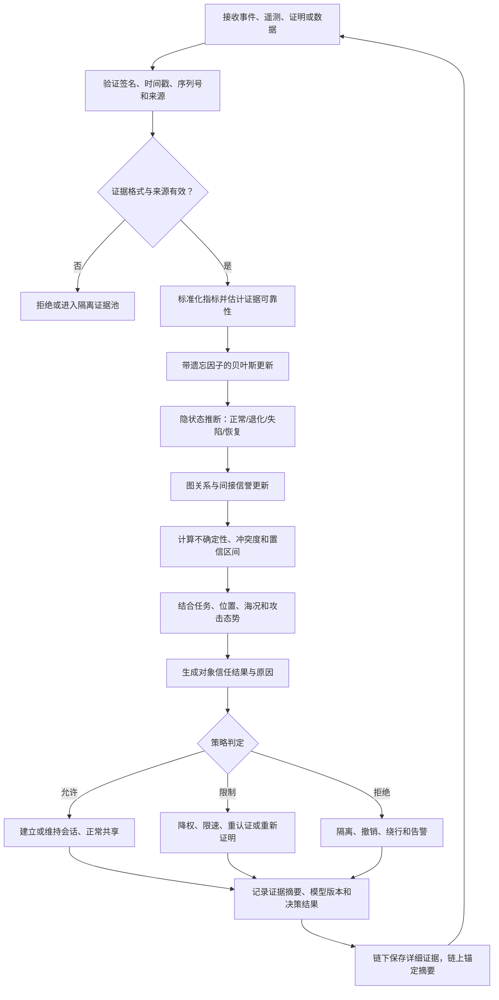

# 跨域无人集群可信数据环境：架构、威胁模型与动态信任度量研究报告草案

## 执行摘要

本报告建议将拟投稿综述的核心问题凝练为：

> **在空中—海面—水下—卫星—岸基多域协同、通信间歇且部分节点可能失陷的条件下，如何围绕实体、设备、链路和数据四类对象，构建可验证、可度量、可持续更新、可审计并可直接驱动认证、传输、共识、共享和任务决策的可信数据环境。**

这一选题具有较好的交叉创新性。现有研究通常分别讨论异构无人系统协同、无人机或水下网络安全、数据融合、零信任、区块链存证或物联网信任管理，较少形成同时覆盖**跨域物理环境、四类信任对象、跨对象攻击路径、动态不确定性以及任务决策闭环**的统一框架。近年来的跨域无人集群研究已明确将“在共同任务目标驱动下、不同空间域和功能平台相互配合”视为跨域协同的基本内涵，并指出高可靠低时延通信、异构网络融合和任务级信息共享是其关键基础。citeturn6view2turn5search23turn0search2

建议将论文的原创性定位为“**综述加参考架构加形式化方法框架**”，而不是一般性的“区块链赋能无人集群”综述。具体贡献可概括为：

1. 提出跨域无人集群可信数据环境的统一定义和边界；
2. 将信任对象形式化为实体、设备、链路、数据四类，并明确它们之间的因果依赖；
3. 构建认证、传输、共识、共享、决策五模块架构，并设置横贯各层的动态信任平面；
4. 建立由对象攻击面、跨对象攻击路径、任务影响和防护控制组成的威胁模型；
5. 提出结合贝叶斯时序更新、隐状态估计、图信誉传播和联盟链审计的动态信任度量方法；
6. 给出可复现实验矩阵、数据集、仿真平台和评价指标体系。

从投稿适配性看，MDPI *Blockchains* 将自身定位为面向区块链及其应用的跨学科、同行评议开放获取期刊，综述稿要求包含完整前置信息和有组织的文献综述章节。citeturn0search1turn7search1 因此，论文中区块链不能仅作为末端“存证工具”，而应被明确限定为可信数据环境中的以下基础设施：

- 跨组织身份和权限状态的共享登记；
- 远程证明、异常告警、信任更新和策略执行结果的防篡改锚定；
- 多组织之间的可审计数据共享与责任追踪；
- 分区恢复后的日志对账和状态同步；
- 不直接承担原始大数据存储，也不被错误地视为判断传感器数据真实性的“真值机器”。

需要特别强调：**共识只能保证多个记账方对记录顺序和状态达成一致，不能证明进入账本的传感器观测本身为真。** 因此，本综述的关键理论价值，是区分“账本一致性”“来源可信性”“内容真实性”“任务可用性”四个不同层次。

截至2026年8月5日，期刊主页公开的动态统计为首次决定约23.8天，与邀请函中“约19天”的表述并不完全一致，说明审稿时长属于动态统计而非承诺。citeturn7search8turn7search2 邀请函中的100%费用减免还应在投稿前要求编辑部将减免信息与投稿账户、稿件类型和有效期明确绑定。

建议拟定英文题目为：

> **Trusted Data Environments for Cross-Domain Unmanned Swarms: Reference Architecture, Object-Centric Threat Modeling, Dynamic Trust Quantification, and Blockchain-Assisted Auditability**

建议围绕以下研究问题组织全文：

| 研究问题 | 核心内容 |
|---|---|
| RQ-A | 什么是跨域无人集群可信数据环境，其边界、目标和基本假设是什么？ |
| RQ-B | 实体、设备、链路和数据的信任属性、证据来源及依赖关系有何差异？ |
| RQ-C | 攻击如何跨越四类对象传播，并最终影响数据融合和任务决策？ |
| RQ-D | 零信任、远程证明、数据溯源、区块链和动态信誉如何形成统一架构？ |
| RQ-E | 如何在通信受限、证据缺失、节点移动和行为突变条件下更新信任？ |
| RQ-F | 现有研究如何评价可信性，哪些数据集、基线和实验指标仍然缺失？ |

## 统一定义、研究边界与四类信任对象

**统一定义。** 本报告将“跨域无人集群可信数据环境”定义为：

> 面向两个或以上物理活动域及多个管理域，由有人或无人操作者、自治智能体、异构无人平台、传感器、通信链路、边缘节点、卫星或岸基基础设施、数据服务和任务应用共同组成的社会—信息—物理系统。该环境在默认网络可能失陷、部分对象可能故障或恶意、通信可能中断的前提下，通过持续身份验证、设备状态证明、链路风险感知、数据来源追踪、动态信任评估、最小权限控制和可审计记录，使任务数据在采集、传输、融合、共享和决策生命周期中保持可验证的真实性、完整性、来源性、新鲜性、可用性、保密性、质量和责任可追溯性。

跨域范围建议至少覆盖：

\[
\mathcal{D}=\{\text{Air},\text{Surface},\text{Underwater},\text{Space},\text{Shore/Cloud}\}
\]

其中包括无人机 UAV、无人水面艇 USV、自主或遥控潜航器 AUV/UUV/ROV、浮标和潜标、固定或移动传感器、中继节点、卫星链路、岸基指挥站和云边平台。现有研究已将UAV、USV和UUV等显著异构平台共同执行统一任务作为跨域异构无人系统的重要形态。citeturn5search10turn5search18turn5search19

可将系统抽象为：

\[
\mathcal{S}=
\left\langle
\mathcal{E},\mathcal{V},\mathcal{L},\mathcal{D},\mathcal{P},
\mathcal{M},\mathcal{C}
\right\rangle
\]

其中：

- \(\mathcal{E}\)：实体集合；
- \(\mathcal{V}\)：设备集合；
- \(\mathcal{L}\)：链路及端到端路径集合；
- \(\mathcal{D}\)：数据及数据版本集合；
- \(\mathcal{P}\)：身份、访问、共享和任务策略；
- \(\mathcal{M}\)：任务、任务阶段和任务风险；
- \(\mathcal{C}\)：环境、位置、时间、拓扑和资源上下文。

信任不是对象的永久固有属性，而应定义为：

\[
T_o(t,c,m)
=
P\left(
o\text{在时刻}t\text{和上下文}c\text{下满足任务}m
\text{所要求的行为与安全属性}
\mid \mathcal{E}_{1:t}
\right)
\]

其中 \(o\) 可以是实体、设备、链路或数据，\(\mathcal{E}_{1:t}\) 是截至当前时刻可获得的直接与间接证据。该定义意味着同一架无人机可以在低敏感度海况观测任务中被允许上传普通图像，却因设备证明过期、定位异常或链路被干扰而不得参与高风险目标识别或共识验证。

**系统边界。**

| 边界类别 | 纳入范围 | 不纳入或仅作为外部条件 |
|---|---|---|
| 组织边界 | 任务发起方、平台所有方、数据提供方、通信运营方、第三方服务方 | 未接入身份和审计体系的外部组织 |
| 物理边界 | UAV、USV、UUV、浮标、传感器、边缘站、卫星和岸基节点 | 海况、天气、地形等作为外部上下文，不作为信任主体 |
| 信息边界 | 原始数据、元数据、融合结果、模型输出、命令、日志、证明材料 | 无法关联来源和时间的历史孤立数据可视为外部输入 |
| 控制边界 | 数据驱动的路径规划、任务分配、协同导航和告警 | 底层飞控或动力系统的完整安全验证不作为综述主体，但其状态证据纳入设备信任 |
| 区块链边界 | 身份摘要、证明摘要、数据哈希、策略版本、信任快照和审计记录 | 大体量视频、声呐点云和连续遥测原则上链下保存 |
| 安全边界 | 网络攻击、内部威胁、物理俘获、数据投毒、供应链失陷和环境故障 | 具体武器效应、平台结构损伤模型和人员生命安全认证属于相邻研究领域 |

**目标。** 可信数据环境应同时满足：

\[
G=
\{
\text{身份真实性、设备完整性、链路韧性、数据完整性、来源可追溯性、}
\]
\[
\text{新鲜性、语义互操作、最小权限、可用性、隐私、问责、任务效用}
\}
\]

零信任体系强调不能仅依据网络位置、所属组织或设备所有权授予隐式信任，而应对每一次资源访问实施动态、细粒度、最小权限和持续评估。citeturn0search0turn0search12turn0search24turn0search36 将这一思想迁移到无人集群时，应进一步考虑弱连接、任务自治和海上节点难以持续连接中央策略引擎的问题。

**基本假设及待明确事项。**

| 假设项 | 本报告采用的工作假设 | 状态 |
|---|---|---|
| 管理域数量 | 存在两个或以上独立组织或安全域 | 建议采用 |
| 平台类型 | 至少包含UAV、USV、UUV中的两类 | 建议采用 |
| 网络状态 | 链路可能高时延、低带宽、间歇中断和动态切换 | 建议采用 |
| 攻击者位置 | 同时考虑外部攻击者、内部恶意实体和已失陷合法设备 | 建议采用 |
| 环境故障 | 海况、噪声、传感器漂移和能源不足可能形成非恶意异常 | 建议采用 |
| 区块链类型 | 联盟链或许可型分布式账本 | 建议采用 |
| 完整节点部署 | 仅部署于USV、岸基站、卫星网关或高能力边缘节点 | 建议采用 |
| 拜占庭节点上限 | 未指定，取决于所选共识协议和验证节点规模 | **未指定** |
| 数据密级与跨境规则 | 未指定 | **未指定** |
| 硬件可信根 | TPM、TEE、安全元件或同类能力是否全平台具备 | **未指定** |
| 全局可信时间源 | GNSS、北斗、网络授时或本地安全时钟的组合 | **未指定** |
| 任务风险等级 | 是否划分普通、敏感、关键、紧急任务 | **未指定** |
| 人工接管规则 | 自动降权、隔离、返航和人工复核的触发边界 | **未指定** |
| 自主智能体法律身份 | 自治体是否被视为独立责任主体 | **未指定** |

**四类信任对象的形式化。**

| 信任对象 | 形式化表示 | 核心属性 | 典型证据 | 核心信任问题 |
|---|---|---|---|---|
| 实体 | \(e=\langle id,role,org,cred,authority,history,intent\rangle\) | 身份、组织关系、角色、授权范围、行为历史、责任归属 | PKI或去中心化标识、任务授权、操作者行为、历史违规、同伴反馈 | “谁在请求或控制资源，其权限和行为是否与任务一致？” |
| 设备 | \(v=\langle did,type,hw,fw,sw,sensor,state,owner\rangle\) | 硬件、固件、软件、传感器状态、能源、位置、配置、所有权 | 远程证明、固件哈希、启动度量、传感器自检、IDS告警、维护记录 | “哪个物理或虚拟端点正在执行，该端点是否完整、健康且未被接管？” |
| 链路 | \(l_{ij}(t)=\langle i,j,medium,path,qos,sec,state\rangle\) | 方向性、介质、时延、误包率、可用性、路由稳定性、加密状态 | SNR、RSSI、时延、抖动、丢包、路由变化、握手结果、干扰检测 | “信息经由什么路径传输，该路径是否被窃听、劫持、阻断或选择性转发？” |
| 数据 | \(d=\langle id,version,producer,time,loc,type,lineage,quality,label,hash\rangle\) | 生成者、时间、位置、模态、版本、来源链、质量、敏感度、完整性 | 数字签名、哈希、时间戳、来源图、校准记录、融合残差、交叉验证 | “该数据来自哪里、是否被改变、是否新鲜、是否合理、是否适合当前任务？” |

需要明确“实体”和“设备”的差异。操作者、组织和自治智能体属于能够发起意图、承担权限或形成行为策略的实体；无人平台则同时具有两重身份：

\[
\text{UAV}_k=
\text{Autonomous Principal}_k
+
\text{Device Endpoint}_k
\]

前者用于判断自主决策行为和任务权限，后者用于判断硬件、固件、传感器和运行时完整性。若不区分两者，就可能出现“设备证明正常，但其合法自治软件正在执行错误或恶意策略”的概念混淆。

数据对象还应采用“不可变版本”而非可被覆盖的文件概念。数据来源可使用W3C PROV模型中的实体、活动和代理关系表示，使原始观测、预处理、融合、模型推理和共享操作形成可查询的来源图。W3C指出，来源信息可用于评价数据或对象的质量、可靠性和可信程度。citeturn2search2turn2search10turn2search28turn2search35

## 系统架构、功能模块与结构性特征

建议采用“**智慧海洋四层体系加可信控制平面**”的总体结构。智慧海洋和水下物联网研究通常可抽象为感知、网络、平台或计算、应用四层；在本研究中，应在四层之外增加横贯全局的身份、策略、信任和审计平面。citeturn0search3turn0search11turn0search15turn0search19



**认证模块。** 认证不应仅包含登录和证书校验，而应形成“实体身份、设备身份、软件状态和任务授权”的多维认证链：

\[
\text{Admission}
=
\text{Entity Authentication}
\land
\text{Device Authentication}
\land
\text{Attestation}
\land
\text{Mission Authorization}
\]

设备状态证明可借鉴IETF RATS体系：证明者产生关于自身状态的证据，验证者按证明策略评价证据，并将证明结果提供给依赖方进行信任决策。citeturn3search0turn3search4turn3search8turn3search28 NIST物联网安全基线还强调设备标识、配置、数据保护、接口访问控制、软件更新和安全状态感知等基础能力，可作为无人终端设备信任指标的重要来源。citeturn3search2turn3search6turn3search14turn3search22

**传输模块。** 应支持多无线接入技术、多跳、自组织、延迟容忍和跨介质网关。水下通信与陆地或空中通信存在根本差异：水声通信通常面临有限带宽、高传播时延、低数据率、高误码率和环境噪声；水下光通信可以实现较高传输速率，但覆盖短、易受遮挡并要求较好对准；低频电磁方式穿透能力较强但速率很低。citeturn1search12turn1search19turn1search20turn6view4 因而不能简单把高时延或大量丢包等同于恶意行为，链路信任必须同时考虑环境模型和攻击模型。

**共识模块。** 适合采用许可型账本，并将完整验证节点部署在资源较强、续航较长且连接性较好的USV、岸基站、卫星网关或任务边缘节点上。资源受限传感器和UUV作为轻节点，仅提交签名事件、数据哈希或批量Merkle根。区块链与物联网结合面临计算、存储、通信和能源限制，传统高计算量共识不适合直接部署在资源受限终端。citeturn4search9turn4search25turn4search28turn4search1

共识模块应遵守三个边界原则：

1. 原始视频、声呐、点云和连续遥测不上链；
2. 链上保存数据摘要、来源关系摘要、策略版本、证明结果和信任状态；
3. 区块链确认“谁在何时声明了什么”，不直接确认“声明内容一定真实”。

**共享模块。** 建议采用链下数据空间、链上索引与策略状态、来源图和属性访问控制相结合的模式。共享授权应由：

\[
Permit =
f(
T_e,T_v,T_l,T_d,
role,purpose,mission,sensitivity,time,location
)
\]

共同决定，而非仅依据用户角色。对于低信任链路，可以仅传输降采样数据或摘要；对于低信任数据，可以允许进入隔离区但禁止进入关键融合模型；对于设备证明失败但任务紧急的节点，可允许其发送低风险遇险信号，同时阻止其发布控制指令。

**决策模块。** 动态信任结果应进入数据融合权重、协同定位、任务分配、路由选择和人工复核逻辑。跨域协同研究已表明，不同平台的传感、机动、通信和续航能力互补，任务效果高度依赖分布式信息交换和多源融合。citeturn5search5turn5search6turn5search26turn6view2

**结构性特征总结。**

| 结构性特征 | 技术表现 | 对可信环境的影响 |
|---|---|---|
| 多维异构 | 平台、运动空间、传感器、协议、能源、自治等级、组织和数据语义均不同 | 不能使用统一静态阈值，信任指标和权重必须按对象与任务定制 |
| 通信受限 | 水声链路高时延低带宽，卫星链路昂贵，海面链路易受阴影衰落，拓扑持续变化 | 需要异步信任更新、证据缓存、断连自治和分区恢复 |
| USV中继关键 | USV兼具较长续航、海面通信条件和跨介质接口，可连接UAV、UUV、卫星和岸基 | USV成为高价值中继和潜在单点高影响目标，应提高其证明与冗余要求 |
| 任务依赖融合 | 搜索、定位、巡检和反潜等任务依赖图像、声呐、位置和环境数据融合 | 数据信任必须进入融合权重和结果置信度，不能只在共享前做一次验证 |
| 零信任持续评估 | 合法节点可能在任务中途被俘获、感染、失效或行为漂移 | 初始认证只能建立起始先验，不能替代持续行为验证 |
| 四层智慧海洋结构 | 感知、网络、平台、应用层之间存在跨层依赖 | 信任必须横跨各层，避免各层独立打分形成重复计算和矛盾决策 |
| 强环境不确定性 | 海况、噪声、遮挡、漂移和能源下降会产生类似攻击的异常 | 必须显式区分恶意、不可靠、暂时退化和证据不足 |
| 管理域分散 | 多组织共同拥有平台、链路和数据，信任根不完全一致 | 需要联盟治理、身份联邦、策略映射和可审计责任链 |

USV中继的重要性应作为论文中的独立讨论点。已有跨域协同研究将USV视为连接水面、水下和空中平台的重要导航与通信支撑；在反潜搜索研究中，USV也被直接用于无人机或跨域平台的通信中继。citeturn0search6turn5search5turn5search6turn5search14 但这也意味着USV一旦被劫持，可同时影响路由、时间同步、数据汇聚和账本接入，形成“高介数节点风险”。

## 威胁模型、攻击面与跨对象攻击路径

建议采用“**攻击者—能力—对象—路径—影响—控制**”六元威胁模型：

\[
\mathcal{A}
=
\langle
actor,capability,target,path,impact,countermeasure
\rangle
\]

**攻击者类型**包括外部网络攻击者、恶意内部人员、被俘获或植入恶意软件的合法设备、恶意合作组织、供应链攻击者以及伪装为合法自治体的Sybil节点。非恶意故障、环境噪声、传感器漂移和软件缺陷虽然不属于攻击者，但应进入同一异常与信任退化模型，否则系统会把自然退化错误解释为恶意行为。

**能力假设**包括监听、流量分析、干扰、欺骗、重放、中间人、路由操纵、凭证盗窃、恶意固件、物理俘获、数据投毒、模型投毒、共谋推荐、账本验证节点失陷和拒绝服务。攻击者数量、协调能力和拜占庭节点比例为**未指定**，应在实验部分参数化。

**安全资产**包括身份凭据、任务权限、设备控制面、位置和时间、通信可用性、数据内容和元数据、融合模型、信任模型参数、账本密钥、智能合约和任务决策。

| 信任对象 | 主要攻击向量 | 典型攻击路径 | 可能影响 | 检测信号 | 缓解措施 |
|---|---|---|---|---|---|
| 实体 | 凭证盗窃、权限滥用、内部人员恶意操作、身份冒充、Sybil身份、跨组织权限映射错误 | 窃取操作者凭证→签发合法任务命令→设备接受命令→恶意数据或路径进入集群 | 非法控制、权限升级、责任混淆、任务重定向 | 异常登录、地理不可能性、指令序列偏离、双重角色冲突、历史行为变化 | 强身份认证、短期任务凭证、职责分离、行为分析、风险自适应授权、快速撤销 |
| 设备 | 物理俘获、恶意固件、传感器篡改、调试口利用、密钥提取、恶意更新、克隆设备 | 合法设备被俘获→密钥未撤销→继续通过认证→上传伪造观测→影响融合 | 假数据、恶意路由、平台失控、横向移动 | 远程证明失败、固件哈希变化、运动学不一致、传感器相关性异常、能耗异常 | 安全启动、硬件可信根、远程证明、密钥轮换、最小服务面、传感器交叉验证、隔离 |
| 链路 | 干扰、窃听、重放、中间人、虫洞、黑洞、灰洞、路由欺骗、时间同步攻击、卫星链路阻断 | 干扰水声链路→流量转移到USV→伪造中继提供低代价路由→选择性丢弃关键包 | 可用性下降、数据延迟、拓扑分裂、错误时间戳、数据选择偏差 | SNR突变、丢包与海况模型不符、路由不对称、重复序列号、时延分布异常 | 多链路切换、频率和路径多样化、端到端认证、抗重放、邻居验证、DTN、冗余中继 |
| 数据 | 伪造、篡改、重放、延迟、删除、语义替换、标签投毒、融合投毒、模型输出操纵、来源图伪造 | 恶意设备生成“有效签名”的假观测→经安全链路传输→哈希上链→融合系统误认为可信 | 错误态势、误报漏报、路径规划偏差、错误任务分配 | 来源缺口、时间或位置不一致、跨源残差、物理约束违背、模型不确定性上升 | 来源追踪、数据版本、时空合理性检查、鲁棒融合、异常隔离、链上摘要、人工复核 |
| 共识与账本，跨对象 | 验证节点密钥泄露、共谋、审查交易、分区分叉、智能合约缺陷、状态回滚、元数据泄露 | USV验证节点失陷→拒绝记录撤销事件→被盗设备持续被视为合法 | 错误状态持久化、审计缺失、撤销失效、治理失灵 | 验证者行为差异、提案审查、区块延迟、状态根不一致、异常合约调用 | 多组织验证者、门限签名、合约审计、治理隔离、检查点、分区恢复规则、链下独立告警 |

无人机和飞行自组网安全研究普遍将欺骗、干扰、拒绝服务、恶意路由、节点俘获和数据操纵视为关键攻击面；水下声学网络还因广播介质、长时延和能源限制面临特殊的拒绝服务与路由风险。citeturn1search11turn1search19turn4search23

建议重点分析以下三条跨对象攻击链。

**合法身份驱动的错误数据链：**

\[
\text{Credential Theft}
\rightarrow
T_e\uparrow
\rightarrow
\text{Malicious Command}
\rightarrow
\text{Compromised Device}
\rightarrow
\text{Signed False Data}
\rightarrow
\text{Ledger Anchoring}
\rightarrow
\text{Wrong Decision}
\]

此路径说明，签名和上链只能证明数据由某密钥提交，不能证明数据内容真实。必须结合设备证明、传感器状态、时空合理性和跨源一致性。

**中继劫持与选择性数据偏置链：**

\[
\text{Acoustic Jamming}
\rightarrow
\text{Route Migration to USV}
\rightarrow
\text{Malicious Relay}
\rightarrow
\text{Selective Forwarding}
\rightarrow
\text{Biased Observation Set}
\rightarrow
\text{Fusion Bias}
\]

该攻击不必修改任何数据，只需选择性丢弃与攻击者目标不一致的数据，便可改变融合结果。因此，数据完整性之外还要评价数据集的**覆盖完整性和缺失机制**。

**慢速信任操纵链：**

\[
\text{Normal Behavior}
\rightarrow
\text{High Reputation}
\rightarrow
\text{Intermittent Malice}
\rightarrow
\text{Rapid Recovery}
\rightarrow
\text{Repeated On-Off Attack}
\]

静态加权平均和长时间窗口容易被“先积累信誉、后间歇攻击”的策略利用。动态模型需要状态转移、负面证据非对称惩罚、恢复观察期和阈值滞回。

此外，应专门讨论以下区块链局限：

- **输入可信性问题**：区块链无法自行验证物理世界传感器真值；
- **分区一致性问题**：海上网络分裂期间，不同区域可能形成冲突状态；
- **隐私问题**：即使只上链哈希，时间、主体和交易频率等元数据仍可能泄露任务活动；
- **撤销问题**：不可篡改不等于不能更正，应通过追加撤销、废止和新版本记录纠错；
- **密钥问题**：链上记录可靠性依赖签名密钥和验证节点密钥安全；
- **实时性问题**：关键飞控和避碰不应等待链上最终确认；
- **治理问题**：联盟成员加入、退出、验证权和争议处理属于组织信任，而非纯技术问题。

## 动态信任度量模型、更新流程与接口设计

建议将该方法命名为：

> **面向四类对象的上下文—时序—图关联动态信任模型**  
> Contextual Temporal Graph-based Object Trust，CTG-Trust

其设计原则为：

- 分对象：实体、设备、链路、数据使用不同指标；
- 分任务：同一对象在不同任务中的信任值可以不同；
- 分上下文：位置、海况、链路介质和任务阶段进入评估；
- 显式不确定性：输出分布或区间，而非只有单一分数；
- 时间敏感：支持突变、遗忘、恢复和周期性攻击；
- 依赖感知：数据可信度依赖来源设备、实体和传输路径；
- 抗共谋：间接推荐需考虑推荐者可信度、独立性和相似性；
- 可审计：证据摘要、模型版本和策略结果可锚定到联盟链。

**指标集。**

| 对象 | 指标维度 | 代表性指标 | 数据来源 |
|---|---|---|---|
| 实体 | 身份保证 | 凭证等级、签发机构、任务授权、新鲜度、撤销状态 | 身份系统、PKI、联盟成员目录 |
| 实体 | 行为合规 | 指令是否符合角色、任务和时间窗口，历史违规率 | 指挥日志、策略执行点 |
| 实体 | 责任与信誉 | 历史任务成功、争议记录、同伴反馈 | 任务记录、审计账本 |
| 设备 | 完整性 | 安全启动、固件和配置证明、补丁状态 | RATS、TPM、TEE或安全元件 |
| 设备 | 健康度 | 能源、温度、传感器自检、存储和计算状态 | 遥测、自检日志 |
| 设备 | 行为合理性 | 速度、加速度、位置、航迹、消息频率是否合理 | 导航、遥测、数字孪生 |
| 设备 | 网络安全 | IDS异常、接口扫描、异常进程、密钥事件 | IDS、主机日志 |
| 链路 | 质量 | SNR、RSSI、时延、抖动、误包率、吞吐、可用率 | 调制解调器、网络测量 |
| 链路 | 安全状态 | 加密套件、认证状态、重放告警、路由可信度 | 会话和路由日志 |
| 链路 | 环境一致性 | 实际退化是否符合海况、距离和传播模型 | 环境数据、信道模型 |
| 数据 | 密码学完整性 | 签名、哈希、时间戳、版本和防重放 | 数据包、账本 |
| 数据 | 来源完整性 | 生产者、处理活动、模型和共享过程是否可追踪 | W3C PROV来源图 |
| 数据 | 新鲜与时空合理性 | 年龄、位置、采样间隔和任务窗口 | 元数据、任务计划 |
| 数据 | 内在质量 | 完整性、噪声、分辨率、校准状态、缺失率 | 数据质量服务 |
| 数据 | 外部一致性 | 与邻近传感器、物理模型和融合预测的一致程度 | 多源数据、数字孪生 |
| 数据 | 任务效用 | 对当前识别、定位或规划任务的贡献 | 决策模型、融合残差 |

物联网信任管理研究通常采用信誉、贝叶斯推断、模糊逻辑、机器学习、多属性评分或推荐机制，并使用时间驱动或事件驱动更新；现有综述也指出，可扩展性、上下文感知、攻击鲁棒性和实验可复现性仍是主要不足。citeturn4search10turn4search18turn4search22turn4search26turn4search32

**证据表示。** 对对象 \(o\) 的第 \(i\) 类第 \(k\) 条证据表示为：

\[
e_{oik}
=
\langle
s_{oik},r_{oik},\tau_{oik},src_{oik},c_{oik}
\rangle
\]

其中：

- \(s_{oik}\in[0,1]\)：证据支持程度；
- \(r_{oik}\in[0,1]\)：证据可靠性；
- \(\tau_{oik}\)：证据时间；
- \(src_{oik}\)：证据来源；
- \(c_{oik}\)：证据适用上下文。

证据可靠性不能直接等同于证据内容。例如，由低信任设备报告的“邻居异常”应降低权重；同一组织控制的多个节点可能不具备统计独立性，也不应被视为多个独立推荐。

**贝叶斯时序更新。** 对每一项指标维护Beta分布：

\[
\theta_{oi}\sim Beta(\alpha_{oi},\beta_{oi})
\]

带遗忘因子的更新规则为：

\[
\alpha_{oi}^{t}
=
\alpha_{0i}
+
\sum_{k=1}^{n}
\lambda_i^{t-\tau_k}
r_{oik}s_{oik}
\]

\[
\beta_{oi}^{t}
=
\beta_{0i}
+
\sum_{k=1}^{n}
\lambda_i^{t-\tau_k}
r_{oik}(1-s_{oik})
\]

其中 \(\lambda_i\in(0,1]\) 为遗忘因子。指标均值和方差为：

\[
\mu_{oi}
=
\frac{\alpha_{oi}}
{\alpha_{oi}+\beta_{oi}}
\]

\[
Var(\theta_{oi})
=
\frac{\alpha_{oi}\beta_{oi}}
{(\alpha_{oi}+\beta_{oi})^2
(\alpha_{oi}+\beta_{oi}+1)}
\]

证据较少时，即使均值较高，方差和置信区间也会较大，可防止新节点凭单次正常行为获得过高信任。输出应包括：

\[
TrustResult=
\langle
score,lower,upper,confidence,state,reasons
\rangle
\]

而不是只有一个 \(0.87\) 的孤立分数。

**隐状态建模。** 为处理设备的正常、退化、失陷和恢复状态，建议加入隐马尔可夫模型：

\[
z_t\in
\{\text{Normal},
\text{Degraded},
\text{Compromised},
\text{Recovering}\}
\]

\[
P(z_t=k\mid e_{1:t})
\propto
P(e_t\mid z_t=k)
\sum_j
P(z_t=k\mid z_{t-1}=j)
P(z_{t-1}=j\mid e_{1:t-1})
\]

状态信任分数为：

\[
T_o^{state}(t)
=
\sum_k v_kP(z_t=k\mid e_{1:t})
\]

其中可设置：

\[
v_{\text{Normal}}=1,\quad
v_{\text{Degraded}}\in(0.4,0.8),\quad
v_{\text{Compromised}}\approx0,\quad
v_{\text{Recovering}}\in(0.2,0.6)
\]

恢复状态不应立即恢复到失陷前信任值，而应经历重新证明、密钥轮换、观察期和人工或自动复核。

**图信誉传播。** 建立对象关系图：

\[
G_t=(V_t,E_t)
\]

节点为实体、设备、链路、数据和任务，边表示控制、拥有、传输、生成、加工、推荐和依赖关系。间接信任可表示为：

\[
T_o^{ind}
=
\frac{
\sum_{j\in R_o}
q_jT_{j\rightarrow o}
}{
\sum_{j\in R_o}q_j
}
\]

其中：

\[
q_j=
T_j
\cdot Freshness_j
\cdot ContextSimilarity_j
\cdot Independence_j
\]

为了防止共谋，不建议直接采用算术平均，应使用截尾均值、加权中位数、推荐群聚检测或基于图结构的独立性折扣。主观逻辑能够将信念、不信任和不确定性同时表示，并可用于信任网络传播，是该部分可重点引用的理论基础。citeturn4search2turn4search6

**直接与间接证据融合。**

\[
\rho_o=
\frac{n_o^{eff}}
{n_o^{eff}+\kappa}
\]

\[
T_o^{evidence}
=
\rho_oT_o^{direct}
+
(1-\rho_o)T_o^{ind}
\]

其中 \(n_o^{eff}\) 为有效独立证据量。当直接证据充足时提高直接证据权重；在新节点或断连重连场景中，允许有限使用组织证明或邻居推荐，但保持较高不确定性。

**上下文和任务融合。**

\[
T_o(t,c,m)
=
\sigma
\left[
b_o+
\sum_iw_i(c,m)\operatorname{logit}(\mu_{oi})
+\gamma T_o^{state}
+\eta T_o^{ind}
-\zeta R(c,m)
\right]
\]

其中：

- \(w_i(c,m)\)：按任务和上下文变化的指标权重；
- \(R(c,m)\)：任务风险、环境风险和攻击态势；
- \(\sigma(\cdot)\)：Logistic函数。

例如，高风险协同定位任务应提高设备证明、时间同步和位置合理性权重；普通海况监测可以提高数据质量和能源可用性权重，而降低实时设备证明频率。

**对象依赖。** 数据信任不应简单等于来源设备信任，而应同时考虑：

\[
T_d=
F(
T_d^{intrinsic},
T_e,
T_v,
T_{path},
T_{prov},
T_{cross},
T_{mission}
)
\]

其中：

- \(T_d^{intrinsic}\)：数据签名、完整性、质量和新鲜性；
- \(T_e\)：生产者或操作者信任；
- \(T_v\)：采集设备信任；
- \(T_{path}\)：传输路径信任；
- \(T_{prov}\)：来源链完整性；
- \(T_{cross}\)：跨源一致性；
- \(T_{mission}\)：任务适用性。

应避免重复计算。例如，如果设备异常已经作为数据来源指标使用，就不能在综合阶段无限次重复放大其影响。正式实现可使用贝叶斯网络或因子图表达条件依赖，而不是假定所有指标独立。

**信任到策略的映射。**

| 信任区间示例 | 策略动作 | 适用说明 |
|---|---|---|
| \(T\geq0.85\)，且置信下界高 | 正常访问、正常融合权重 | 阈值仅为示例，需任务校准 |
| \(0.65\leq T<0.85\) | 限权、提高采样验证、降低融合权重 | 适合证据不足或轻微退化 |
| \(0.40\leq T<0.65\) | 仅允许低风险数据、禁止关键控制、请求重新证明 | 适合异常但尚未确认失陷 |
| \(T<0.40\) | 隔离、撤销会话、路由绕行、人工复核 | 适合高风险或确认失陷 |
| 置信度过低 | “未知”而非“恶意”，采用最小风险策略 | 防止因通信中断误杀合法节点 |

应增加滞回机制：

\[
\tau_{revoke}<\tau_{restore}
\]

即信任降至撤销阈值时快速限制，但恢复必须达到更高阈值并保持一定时间，以抵御阈值振荡和开关攻击。

**动态更新流程。**



**区块链记录设计。** 建议链上记录以下字段：

```json
{
  "eventId": "evt-7f23...",
  "objectId": "pseudonymized-object-id",
  "objectType": "DEVICE",
  "evidenceHash": "sha256:...",
  "evidenceType": "REMOTE_ATTESTATION",
  "observedAt": "2026-08-05T03:20:15Z",
  "modelVersion": "ctg-trust-1.2",
  "policyVersion": "mission-policy-7",
  "trustScore": 0.73,
  "confidenceInterval": [0.61, 0.82],
  "state": "DEGRADED",
  "decision": "RESTRICT",
  "signer": "edge-validator-usv-02"
}
```

详细证明、日志和传感器数据保存在链下对象存储或任务数据空间，账本只保存摘要和索引。记录原始信任分数时还需注意敏感性，可只记录区间、状态或加密承诺。

**API示例。**

提交证据：

```http
POST /v1/evidence
Content-Type: application/json
Authorization: Bearer <mission-token>
```

```json
{
  "subject": {
    "id": "uuv-17",
    "type": "DEVICE"
  },
  "evidence": {
    "type": "ATTESTATION_RESULT",
    "score": 1.0,
    "reliability": 0.97,
    "timestamp": "2026-08-05T03:20:15Z",
    "context": {
      "mission": "marine-survey-8",
      "locationCell": "ocean-grid-42",
      "networkPartition": "subsea-cluster-b"
    },
    "payloadHash": "sha256:..."
  }
}
```

查询信任：

```http
POST /v1/trust/evaluate
Content-Type: application/json
```

```json
{
  "subject": "uuv-17",
  "objectType": "DEVICE",
  "mission": "marine-survey-8",
  "requestedAction": "PUBLISH_SONAR_DATA",
  "context": {
    "viaLinks": ["acoustic-link-4", "usv-relay-2"],
    "riskLevel": "HIGH"
  }
}
```

返回结果：

```json
{
  "score": 0.73,
  "lowerBound": 0.61,
  "upperBound": 0.82,
  "confidence": 0.78,
  "state": "DEGRADED",
  "decision": "RESTRICT",
  "obligations": [
    "REDUCE_FUSION_WEIGHT_TO_0.45",
    "REQUEST_FRESH_ATTESTATION",
    "REQUIRE_SECOND_SOURCE_CORROBORATION"
  ],
  "topReasons": [
    "ATTESTATION_FRESH",
    "ACOUSTIC_LINK_PACKET_LOSS_HIGH",
    "POSITION_RESIDUAL_MODERATE"
  ],
  "modelVersion": "ctg-trust-1.2"
}
```

认证模块可以调用实体和设备信任，传输模块调用链路与中继信任，共识模块调用验证者实体和设备信任，共享模块调用实体、数据和路径信任，决策模块调用四类对象组合后的任务信任。

## 评估方法、实验设计与对比基线

建议分为四个评价层面：

\[
Evaluation=
\{
\text{检测有效性},
\text{信任校准},
\text{系统开销},
\text{任务效能}
\}
\]

仅报告攻击检测准确率是不充分的。动态信任系统还必须证明：其分数与真实失陷概率相符；不会把恶劣海况错误判为攻击；不会因区块链开销破坏实时性；并且能提高最终搜索、定位或协同决策效果。

**仿真与试验架构。**

建议采用联合仿真：

- 机器人与物理环境：AirSim、Gazebo、UUV Simulator或同类平台；
- 空中和海面网络：ns-3；
- 水下声学网络：Aqua-Sim NG或后续Aqua-Sim系列；
- 任务与协同控制：ROS/ROS 2或自研多智能体框架；
- 联盟链：Hyperledger Fabric、Besu或其他许可型平台；
- 区块链性能：Hyperledger Caliper；
- 信任服务：独立Python、Java或Go微服务；
- 硬件在环：真实水声通信机、飞控、USV边缘计算节点或安全元件。

AirSim支持无人机和车辆仿真以及软件在环，但原始微软项目的维护状态和版本兼容性需要在正式实验前确认；水下仿真可采用包含Gazebo插件和ROS节点的UUV Simulator。citeturn8search1turn8search5turn8search9turn10search3turn10search16 Aqua-Sim NG基于ns-3并面向水下传感器网络，支持水下声学衰减、碰撞、三维和移动网络建模。citeturn10search0turn10search4 Hyperledger Caliper可用于测量区块链吞吐、时延和资源开销。citeturn8search0turn8search3turn8search7

**核心实验矩阵。**

| 场景 | 平台与拓扑 | 注入事件 | 自变量 | 主要观察指标 |
|---|---|---|---|---|
| 正常跨域协同 | UAV×4、USV×2、UUV×4、岸基×1 | 海况变化、正常丢包、节点移动 | 水声带宽、USV位置、证据频率 | 误报率、任务时延、信任稳定性 |
| USV中继失陷 | 同上，USV为跨域网关 | 灰洞、选择性转发、时间戳操纵 | 丢弃比例、攻击持续时间、中继冗余 | 检测时延、路径切换成功率、融合偏差 |
| UAV身份与GNSS欺骗 | UAV集群 | 凭证盗用、位置欺骗、重放 | 欺骗幅度、证据可靠性 | 实体与设备信任区分能力、定位误差 |
| UUV开关攻击 | UUV周期性正常与恶意 | 虚假声呐、间歇投毒 | 正常/恶意周期、遗忘因子 | 开关攻击检测率、恢复时间、信任振荡 |
| Sybil与共谋推荐 | 多个虚拟实体或设备 | 虚假高分推荐、低分诋毁 | Sybil数、控制组织数、独立性 | 抗共谋误差、间接信任偏差 |
| 链路干扰与环境退化 | 声学、海面、卫星混合链路 | 恶意干扰与自然噪声混合 | SNR、海况、攻击功率 | 攻击/故障区分率、可用性 |
| 数据投毒 | 图像、声呐、位置数据融合 | 标签翻转、目标插入、数据删除 | 投毒比例、来源可信度 | 融合精度、鲁棒性、误报漏报 |
| 网络分区 | 水下簇与岸基断连 | 多账本分支、撤销延迟 | 分区时长、验证者分布 | 恢复时间、冲突数、日志完整性 |
| 验证节点失陷 | USV、岸基联盟链 | 审查撤销、伪造策略状态 | 失陷验证者比例 | 账本可用性、确认时延、错误状态率 |
| 多任务切换 | 巡检转为紧急搜救 | 权重与阈值动态变化 | 任务风险、策略切换时间 | 策略适应性、任务成功率 |

**数据集建议。**

| 数据类型 | 可用数据集或构造方法 | 用途与局限 |
|---|---|---|
| 通用IoT攻击流量 | CICIoT2023 | 含大规模IoT拓扑和多类攻击，可用于预训练网络异常检测，但缺少无人平台运动和海洋链路特征。官方说明其拓扑包括105台设备和33种攻击。citeturn9search1turn9search5 |
| 异构IoT/边缘遥测 | TON_IoT | 包含网络、操作系统和传感器遥测等异构数据，适合多证据融合与边缘异常研究。citeturn9search6 |
| IoT/IIoT与联邦学习 | Edge-IIoTset | 包括多种设备、协议、系统资源、日志和网络攻击，可评估集中式与联邦式信任检测。citeturn9search11 |
| 海上UAV视觉数据 | SeaDronesSee | 可用于构造图像质量、目标检测、环境变化和数据投毒场景，但本身不是网络安全数据集。citeturn8search4turn8search16turn8search27 |
| 水下链路数据 | 真实水声通信日志或Aqua-Sim生成数据 | 需记录SNR、时延、误包、距离、深度、海况和攻击标签；公开统一安全数据集明显不足 |
| 跨域信任数据 | 本研究自建 | 应同步记录实体、设备、链路、数据、攻击真值、任务阶段和策略结果，形成论文的重要开放贡献 |

建议自建数据采用统一事件模式：

\[
record=
\langle
time,object,objectType,domain,context,evidence,
groundTruth,attack,trust,decision,missionOutcome
\rangle
\]

并至少公开匿名化的场景生成脚本、随机种子、攻击时间线、指标定义和模型配置。

**评价指标。**

检测类指标：

\[
Precision,\ Recall,\ F1,\ AUROC,\ AUPRC,
Detection\ Delay,\ False\ Isolation\ Rate
\]

信任校准类指标：

\[
Brier\ Score=
\frac{1}{N}
\sum_{n=1}^N(T_n-y_n)^2
\]

\[
ECE=
\sum_b
\frac{|B_b|}{N}
\left|
accuracy(B_b)-confidence(B_b)
\right|
\]

还应报告置信区间覆盖率、不确定性与错误率相关性、信誉恢复时间、信任振荡幅度和开关攻击下的累积损失。

系统性能指标包括：

- 信任查询时延；
- 证据处理吞吐；
- 单节点CPU、内存、能源和通信开销；
- 区块链交易吞吐和确认时延；
- 链上存储增长；
- 分区恢复和账本对账时长；
- 身份撤销传播时延；
- 每次任务的证明与信任更新消息量。

任务指标包括：

- 搜索覆盖率；
- 目标检测概率；
- 误报和漏报；
- 定位均方误差；
- 路径长度和任务完成时间；
- 集群存活率；
- 数据融合误差；
- 关键任务成功率；
- 攻击期间的效能下降面积。

**对比基线。**

| 基线 | 描述 | 比较目的 |
|---|---|---|
| Static-Trust | 初次认证后信任固定 | 证明持续更新的必要性 |
| Weighted-Sum | 指标静态加权平均 | 比较时序、不确定性和上下文建模 |
| Beta-Reputation | 仅采用Beta信誉更新 | 评价隐状态和图传播增益 |
| Subjective-Logic | 信念、不信任和不确定性传播 | 比较推荐与不确定性处理 |
| HMM-Only | 仅基于行为时序推断状态 | 评价多源证据和依赖图增益 |
| ML-Anomaly | 随机森林、XGBoost、LSTM或自编码器异常检测 | 区分异常分数与可调用信任决策 |
| Blockchain-Only | 只进行身份和数据哈希上链 | 验证“存证不等于动态可信” |
| No-Graph | 不使用实体—设备—链路—数据依赖 | 评价跨对象传播模型 |
| Oracle | 已知攻击真值的理想策略 | 给出理论性能上界 |

必须进行消融实验，分别移除贝叶斯更新、隐状态、图推荐、上下文、区块链审计和置信度机制。还应比较不同遗忘因子、阈值、任务权重、证据频率和区块批处理大小。

## 投稿章节设计、图表规划与文献检索方案

建议最终论文采用“系统化范围综述加设计科学参考框架”的形式。由于研究横跨无人系统、智慧海洋、安全、信任计算和区块链，纯粹按技术关键词罗列文献容易失去主线。更合适的组织方式是：

\[
\text{定义}
\rightarrow
\text{对象}
\rightarrow
\text{架构}
\rightarrow
\text{威胁}
\rightarrow
\text{度量}
\rightarrow
\text{区块链作用}
\rightarrow
\text{评估}
\rightarrow
\text{研究议程}
\]

综述检索和筛选过程可参考PRISMA 2020或范围综述扩展PRISMA-ScR，公开数据库、检索式、时间范围、去重、纳入排除标准和筛选数量。citeturn11search1turn11search2turn11search8turn11search9turn11search10

**建议章节、要点与字数分配。**

| 章节 | 主要内容 | 建议英文单词数 |
|---|---|---:|
| Abstract | 背景、问题、方法、发现、贡献和研究空白 | 220–280 |
| Introduction | 跨域无人集群背景、可信数据问题、区块链适配性、研究问题和贡献 | 900–1200 |
| Review Methodology | 数据库、检索式、时间范围、筛选、编码框架、质量评价 | 700–900 |
| Concepts and Unified Definition | 可信数据环境定义、边界、目标、假设、术语辨析 | 900–1100 |
| Trust Objects and Dependencies | 实体、设备、链路、数据形式化及关系图 | 1200–1500 |
| Structural Characteristics | 异构、通信受限、USV中继、数据融合、智慧海洋四层体系 | 1000–1300 |
| Reference Architecture | 五模块架构、可信控制平面、链上链下分工 | 1400–1800 |
| Threat Model and Attack Surfaces | 攻击者、能力、对象攻击面、跨对象攻击链和区块链威胁 | 1800–2200 |
| Dynamic Trust Quantification | 指标、贝叶斯、时序状态、图传播、不确定性、策略接口 | 1800–2400 |
| Evaluation Methodology | 场景、数据集、仿真、指标、基线、消融 | 1100–1500 |
| Research Gaps and Future Directions | 理论、系统、数据、治理和标准化议程 | 1000–1300 |
| Conclusion | 主要结论和最终架构观点 | 300–450 |
| 合计 | 不含参考文献和附录 | 约13,000–16,000 |

若需要压缩至较短稿件，可将“结构性特征”并入“概念与定义”，把API和完整指标表放入补充材料。

**拟用图清单。**

| 图号建议 | 图题 |
|---|---|
| Figure A | 文献检索、筛选和分类流程图 |
| Figure B | 跨域无人集群物理域、管理域和数据域边界 |
| Figure C | 实体—设备—链路—数据四类信任对象及依赖图 |
| Figure D | 智慧海洋四层体系与可信控制平面参考架构 |
| Figure E | 认证、传输、共识、共享、决策五模块交互 |
| Figure F | 典型跨对象攻击路径和攻击图 |
| Figure G | CTG-Trust动态信任更新流程 |
| Figure H | 链上记录、链下数据和来源图协同机制 |
| Figure I | 联合仿真与硬件在环实验环境 |
| Figure J | 研究空白与未来路线图 |

**拟用表清单。**

| 表号建议 | 表题 |
|---|---|
| Table A | 相关综述的范围、对象、模型、区块链角色和不足比较 |
| Table B | 核心概念、边界和假设 |
| Table C | 四类信任对象的属性、证据和信任问题 |
| Table D | 空中、海面、水下、卫星链路技术特性比较 |
| Table E | 结构性特征及其安全影响 |
| Table F | 五个功能模块及输入输出 |
| Table G | 四类信任对象的威胁映射 |
| Table H | 区块链相关威胁和设计边界 |
| Table I | 动态信任指标体系 |
| Table J | 信任计算方法比较 |
| Table K | 数据集、仿真平台和适用范围 |
| Table L | 实验场景和攻击参数矩阵 |
| Table M | 评价指标和对比基线 |
| Table N | 研究空白和未来研究问题 |

**文献检索范围。** 建议以2016年1月至最终检索日为主要窗口，对零信任、数据来源、主观逻辑、PBFT或基础水声通信等奠基文献放宽时间限制。

英文数据库建议覆盖：

- Web of Science Core Collection；
- Scopus；
- IEEE Xplore；
- ACM Digital Library；
- ScienceDirect；
- SpringerLink；
- MDPI；
- IETF、NIST、W3C、ETSI、3GPP和ISO官方文档库。

中文来源建议优先：

- 中国知网、万方和维普；
- 《中国工程科学》；
- 《中国舰船研究》；
- 《系统仿真学报》；
- 《通信学报》；
- 《电子学报》；
- 《计算机学报》；
- 《自动化学报》；
- 《宇航学报》；
- 海洋、船舶、水声、指挥控制和无人系统相关核心期刊。

推荐英文检索式：

```text
("cross-domain" OR "multi-domain" OR "air-sea" OR "air-surface-underwater")
AND
("unmanned system*" OR UAV OR USV OR UUV OR AUV OR swarm*)
AND
(trust OR trustworthy OR security OR "data environment" OR provenance)

("unmanned swarm*" OR "heterogeneous unmanned system*")
AND
("trust management" OR reputation OR "zero trust" OR attestation)

(blockchain OR "distributed ledger")
AND
(UAV OR USV OR UUV OR "underwater IoT" OR "maritime IoT")
AND
(trust OR provenance OR authentication OR "data sharing")

("underwater communication" OR "maritime communication")
AND
(jamming OR spoofing OR attack OR security OR relay)

("data fusion" OR "multi-sensor fusion")
AND
(trust OR reliability OR provenance OR adversarial)
AND
(unmanned OR maritime)
```

推荐中文检索式：

```text
（跨域 OR 多域 OR 海空 OR 空海潜 OR 空天地海）
AND（无人集群 OR 异构无人系统 OR 无人机 OR 无人艇 OR 无人潜航器）
AND（可信 OR 信任 OR 安全 OR 数据环境）

（无人集群 OR 海上无人系统）
AND（零信任 OR 动态信任 OR 信誉评估 OR 可信度量）

（区块链 OR 分布式账本）
AND（无人系统 OR 智慧海洋 OR 水下物联网）
AND（数据共享 OR 溯源 OR 身份认证 OR 信任管理）
```

**优先引用层级。**

| 优先级 | 来源类型 | 重点来源 |
|---|---|---|
| 最高 | 标准、规范和政府技术指南 | NIST SP 800-207零信任、NISTIR 8259A、IETF RATS RFC 9334、W3C PROV、3GPP UAS和海事通信规范 |
| 很高 | 跨域无人系统和海洋工程权威综述 | 《中国工程科学》《中国舰船研究》及IEEE、Elsevier高水平综述 |
| 很高 | 水下通信和网络安全原始论文 | IEEE Communications Surveys & Tutorials、IEEE IoT Journal、IEEE Access及水声通信领域期刊 |
| 很高 | 信任与信誉理论原始文献 | 贝叶斯信誉、主观逻辑、隐状态和图信任模型 |
| 高 | 区块链与资源受限物联网研究 | 许可链、轻节点、BFT、链上链下数据管理、区块链性能评估 |
| 高 | 数据来源、融合和质量研究 | W3C PROV、多传感器融合、鲁棒统计和不确定性量化 |
| 中 | 仿真平台、开源数据集和技术文档 | AirSim、Aqua-Sim、UUV Simulator、Hyperledger Caliper、CICIoT2023、TON_IoT |
| 辅助 | 预印本、项目报告和产业白皮书 | 用于跟踪前沿方向，不作为核心结论的唯一依据 |

3GPP目前分别列有UAS支持和海事通信服务相关规范，可用于分析空中平台接入、控制通信和海事网络需求。citeturn2search0turn2search8turn2search15turn2search22

**文献编码框架。** 每篇文献至少提取：

\[
\langle
year,domain,platform,task,trustObject,threat,
evidence,model,update,uncertainty,blockchainRole,
dataset,simulator,metrics,limitations
\rangle
\]

这将使综述能够回答“研究覆盖了哪些对象、采用何种证据、是否动态更新、是否显式处理不确定性、区块链究竟解决什么问题”等结构性问题，而非停留在论文摘要汇总。

## 研究空白、关键挑战与未来研究方向

**缺少跨对象统一信任语义。** 现有工作常将设备信誉、链路质量和数据可信度混合为一个分数，导致信任含义不明确。未来应建立机器可读的对象信任本体，明确“设备完整但数据异常”“链路不可靠但非恶意”“实体合法但越权”等状态。

**通信缺失与恶意行为难以区分。** 在水下和海上网络中，丢包、高时延和间歇连接可能由环境、能源、运动或攻击造成。未来模型应联合信道传播、海况、平台运动和攻击行为进行因果推断，而不是仅依赖统计异常。

**USV中继形成新的系统性集中风险。** USV虽然是连接空中、水面、水下和卫星链路的理想平台，但也可能成为身份代理、时间源、路由中心、数据汇聚点和区块链验证者。一艘USV失陷可能跨层放大影响。未来需研究多USV冗余、职责分离、门限签名和基于网络介数的动态风险调整。

**区块链一致性与数据真值之间存在研究断层。** 大量研究把不可篡改直接等同于数据可信。未来应建立三阶段模型：

\[
\text{Observation Trust}
\rightarrow
\text{Submission Trust}
\rightarrow
\text{Ledger Consensus}
\]

只有第一阶段评价物理观测真实性，第二阶段评价提交者和传输过程，第三阶段评价记录一致性。三个阶段不能相互替代。

**网络分区下的信任状态缺少一致性语义。** 水下簇可能长时间离线，导致身份撤销、策略更新和信任状态无法及时传播。未来需要研究：

- 本地自治信任缓存；
- 可验证的离线授权；
- 失效时间和最大断连期限；
- 分区期间的本地追加日志；
- 恢复后的冲突解决；
- 信任状态的单调与非单调更新规则。

**对不确定性和证据冲突处理不足。** 多数模型只输出单一分数。未来应输出后验分布、置信区间、证据冲突度和“未知”状态，使决策层能够区分低信任与低证据。

**开关攻击、共谋和信誉漂白仍是核心挑战。** 新身份注册、设备重置或组织迁移可能清除负面历史。未来应将设备制造身份、组织身份、任务身份和隐私保护伪名进行可控关联，并设计恢复期和负面证据非对称更新。

**信任模型自身可能被攻击。** 攻击者可操纵权重、训练数据、推荐关系、环境模型或模型版本。未来应将信任引擎视为关键安全资产，研究模型签名、可验证配置、对抗鲁棒性、模型版本账本和独立复算。

**缺少跨域公开基准。** 通用IoT数据集不能充分反映无人平台运动、跨介质链路、任务阶段和数据融合。一个有价值的论文扩展方向，是发布可重复的跨域场景生成器和多对象事件数据集。

**评价过度集中于检测准确率。** 未来应将信任评估与任务指标绑定，例如：

\[
\Delta MissionUtility
=
MissionUtility_{\text{trust-aware}}
-
MissionUtility_{\text{baseline}}
\]

只有证明信任机制能提高搜索覆盖、降低定位误差、维持连接或减少错误决策，才能说明其工程价值。

**人—自治体—组织混合信任尚未充分研究。** 自治体既执行软件策略，又受组织规则、操作者命令和模型训练影响。未来需要区分：

- 对组织规则的信任；
- 对操作者身份和行为的信任；
- 对自治软件完整性的信任；
- 对模型能力和适用范围的信任；
- 对当前具体决策的信任。

**隐私与问责存在张力。** 完全可追踪可能暴露平台位置、任务节奏和组织关系；完全匿名又削弱责任追究。未来可研究选择性披露、可撤销匿名、零知识证明、群签名和基于任务的伪名轮换。

**密码敏捷性和长期任务安全。** 无人平台服役周期长、远程升级困难，未来应考虑密码算法迁移、密钥轮换、设备失联后的撤销、软件物料清单以及后量子算法带来的消息和计算开销。

**标准映射不足。** 零信任、远程证明、物联网设备基线、数据来源和UAS通信均已有相对独立的规范，但缺少面向跨域无人集群的统一配置文件。一个重要未来方向是提出：

> Cross-Domain Unmanned Trust Profile，CDUTP

其可映射：

- NIST零信任中的策略引擎、策略管理器和执行点；
- IETF RATS中的证明者、验证者和依赖方；
- W3C PROV中的实体、活动和代理；
- 3GPP中的UAS和海事通信服务；
- 联盟链中的成员、验证者、合约和账本状态。

本综述最终应形成一个明确结论：**跨域无人集群的可信问题不是“是否采用区块链”，而是如何以四类信任对象为核心，将身份、证明、通信、来源、质量、信誉、策略和审计组织为可持续运行的任务闭环。区块链最适合作为多组织环境下的共享状态与审计基础，而动态信任引擎负责解释现实世界中不完整、冲突和时变的证据。**